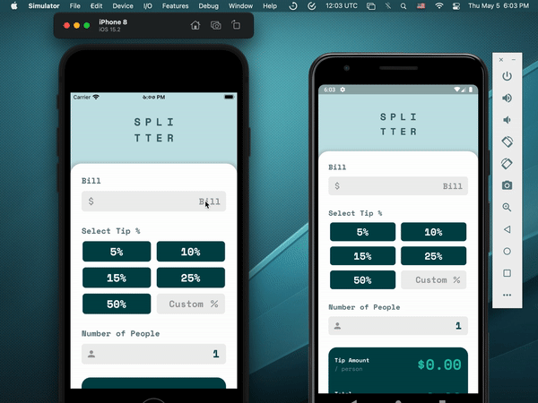

&nbsp;&nbsp;
&nbsp;&nbsp;
<a href="https://choosealicense.com/licenses/mit/" target="_blank"></a>&nbsp;&nbsp;
&nbsp;&nbsp;


# Tip Calculator

</img>
This application is an UI challenge from <a href = "https://www.frontendmentor.io/challenges/tip-calculator-app-ugJNGbJUX">frontend mentor</a>. It is a 'Tip Calculator'. It's an open-source project, hence use of the source code is governed by an MIT-style license that can be found in the LICENSE file or at <a href = "https://choosealicense.com/licenses/mit/">MIT LICENSE Info.</a>

## Packages Used

This application is using one third-party package from the open-source community. Thanks to the developers of <a href = "https://pub.dev/packages/flutter_svg">flutter_svg: ^1.1.0 </a> for this amazing package. The purpose of using this package is to enable the support of SVG files in the flutter application. It's a Dart-native rendering library.

```
  flutter_svg: ^1.1.0   //For rendering svg images
```

## App Demo

<p align="center"></p>

## File Pattern Inside The `lib` Folder

```
lib/
├── app/
│   ├── widget/
│   │   ├── amount_text.dart
│   │   └── constant.dart
│   └── home_page.dart
└── main.dart
```
